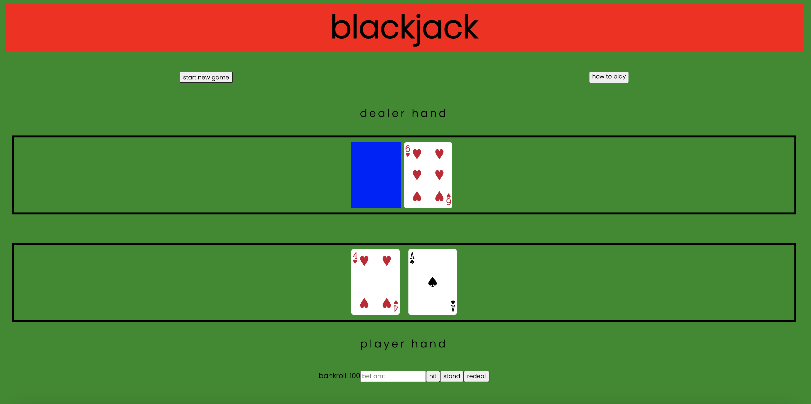
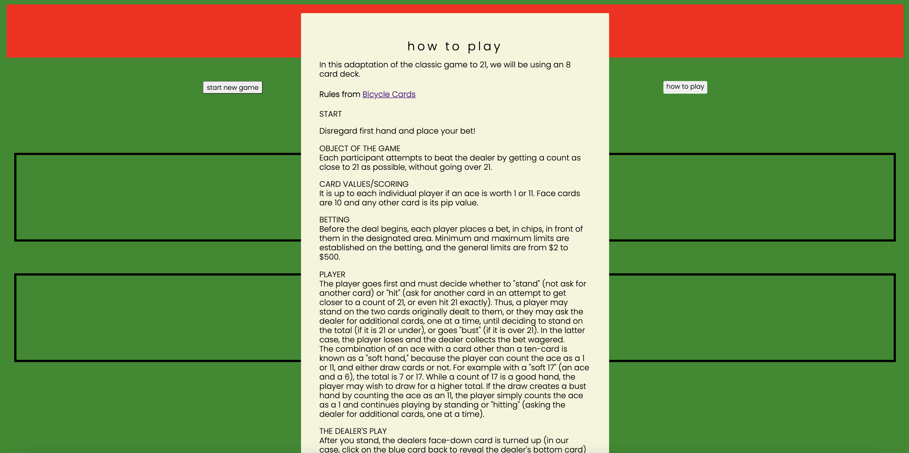
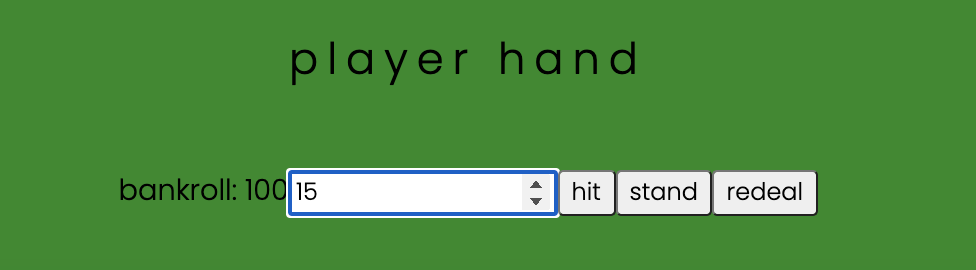
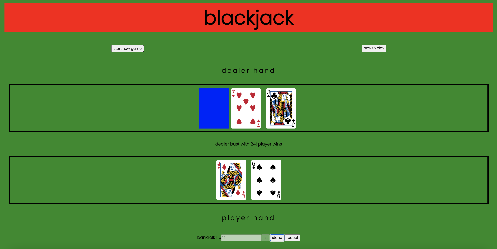

Blackjack ReadMe.md

App Screenshot

List of the Technologies used

- HTML
- CSS
- Javascript

Installation instructions

- load https://chinsan-lim.github.io/blackjack/ on your browser and start playing!

Your User stories – who are your users, what do they want and why?

- As a user, I want to be able to place a bet, so I can win money from the dealer.
- As a user, I want the game to deal 2 cards face up to me, and one card face up and one face down for the dealer.
- As a user, I want to able to hit or add a card, so I can get closer to 21.
- As a user, I want to able to stand, so I can end my turn.
- As a user, I want the dealer to hit until his cards add up to more than 17 (and hopefully more than 21).
- As a user, I want the game to compare our card totals, so I can see who the winner is.
- As a user, I want to able to restart the game with my updated bankroll, so I can keep playing

Your Wireframes – sketches of major views / interfaces in your application

Here are directions of how to play blackjack. It includes directions on how to get started.

Here is where you make all your decisions: bet size, hit, stand, or redeal. Your bankroll dynamically changes with your bet and outcome of the hand.

After your round ends, the winner is outputted in the center of your screen and your bankroll is updated. Note that after you click the stand button, your hit button and bet input fields are disabled to prevent adding more cards or changing your bet.

Descriptions of any Unsolved problems or major hurdles you had to overcome

Unsolved problems:

- starting the game with an empty game board (I think I need to use the 'start new game' button to trigger the 'deal cards' function, but the issue is that my 'redeal hand' function calls upon the card deal. needs a bit of code restructuring)
- revealing the dealer's bottom card without the user having to click on it (I could not figure out how to make the blue card bottom switch to transparent when the user clicks the 'stand' button.)

Major hurdles:

- using card images (I sourced the card images I was able to find and managed to connect them to each card value using string interpolation for the file path in the constructor function)
- removing DOM created cards when the player/dealer hit (Strangely, the player hand and dealer hand arrays had 5 and 6 child nodes, respectively, when there were only 2 card elements in the hand. After further inspection, the extra elements were simple text elements, but I could not find where they were. The code was frankenstein-ed to account of the extra children)
- dynamically changing the bankroll (changing back and forth between string and number variables made this a bit confusing)

Future additions:

- double button function: allow user to double their bet and hit for only one card
- split button function: if the user is dealt a pair, they can split the pair and play different hands, wagering the same original bet for both hands
- surrendering hand: if player does not like their hand, they can give up their hand and half their wager is returned
- insurance: blackjack insurance odds pay out at 2/1 and the maximum bet allowed is generally half of the player’s main bet when the dealer's top card is an Ace.
- adding a second player
